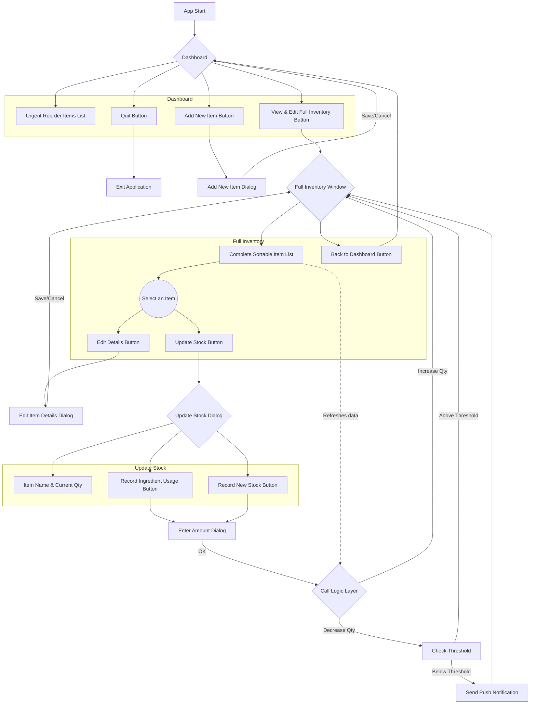

```mermaid
graph TD
    A[App Start] --> B{Dashboard};

    subgraph Dashboard
        B_urgent[Urgent Reorder Items List]
        B_view[View & Edit Full Inventory Button]
        B_add[Add New Item Button]
        B_quit[Quit Button]
    end

    B --> B_urgent;
    B --> B_view;
    B --> B_add;
    B --> B_quit;

    B_quit --> Z[Exit Application];
    
    B_add --> D[Add New Item Dialog];
    D -- Save/Cancel --> B;

    B_view --> E{Full Inventory Window};

    subgraph Full Inventory
        E_list[Complete Sortable Item List]
        E_select((Select an Item))
        E_update[Update Stock Button]
        E_edit[Edit Details Button]
        E_back[Back to Dashboard Button]
    end

    E --> E_list --> E_select;
    E_select --> E_update;
    E_select --> E_edit;
    E --> E_back;
    
    E_back --> B;

    E_edit --> F[Edit Item Details Dialog];
    F -- Save/Cancel --> E;

    E_update --> G{Update Stock Dialog};
    
    subgraph Update Stock
        G_info[Item Name & Current Qty]
        G_use[Record Ingredient Usage Button]
        G_add[Record New Stock Button]
    end

    G --> G_info;
    G --> G_use;
    G --> G_add;

    G_use --> H[Enter Amount Dialog];
    G_add --> H;

    H -- OK --> I{Call Logic Layer};
    I -- Decrease Qty --> J[Check Threshold];
    I -- Increase Qty --> E;

    J -- Below Threshold --> K[Send Push Notification];
    J -- Above Threshold --> E;
    K --> E;

    E_list -. Refreshes data .-> I;
```
